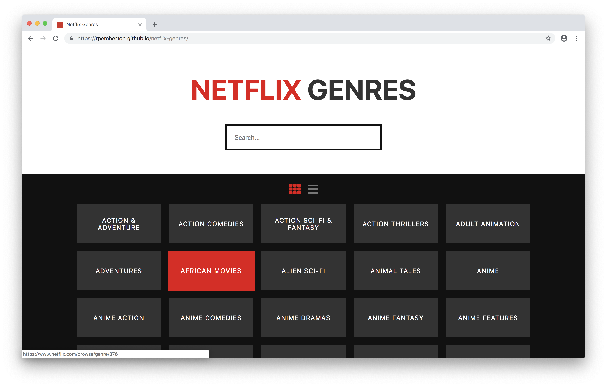

# Netflix genres scrape and search

Live demo: https://rpemberton.github.io/netflix-genres

This is an app that scrapes Netflix genre data from [this webpage](https://whatsonnetflix.com/netflix-hacks/the-netflix-id-bible-every-category-on-netflix) and makes it searchable.

* To test out the scrape function, [this](src/model/scrape.js) can be pasted into the browser console when on the [whatsonnetflix](https://whatsonnetflix.com/netflix-hacks/the-netflix-id-bible-every-category-on-netflix) page.
* An example of the output is [here](src/model/genres.json).

## About the code
* No JS frameworks
* No CSS frameworks
* Focus on functional programming
* Focus on separation of concerns
* Webpack and Babel
* Mobile first / progressive enhancement
